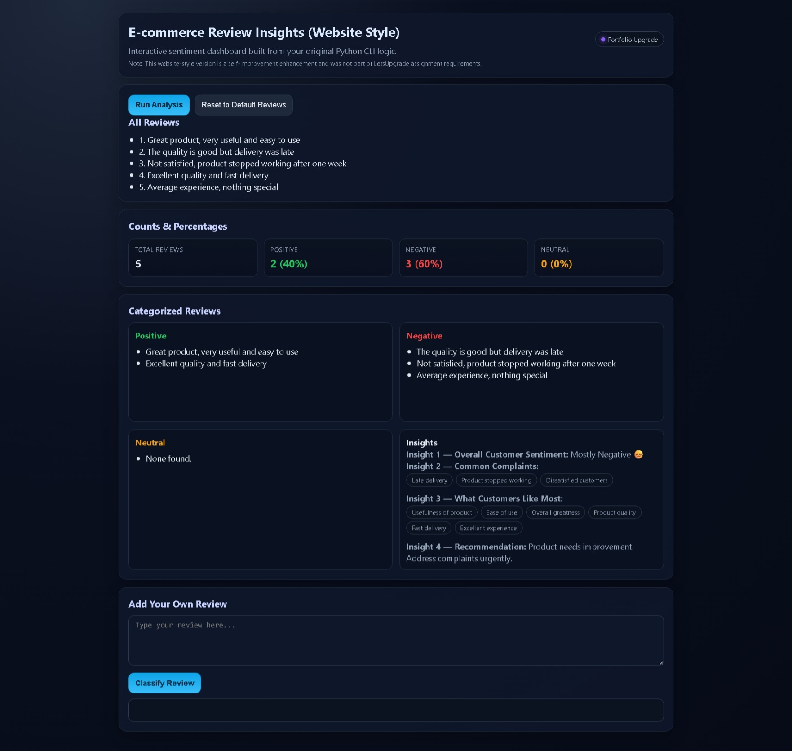

# E-commerce Review Insights

> Completed as part of **E-commerce Review Insights Essentials: End-to-End Python Mini Project** — LetsUpgrade Bootcamp Program

A Python program that analyses e-commerce product reviews using keyword matching. Classifies each review as positive, negative, or neutral. Prints counts, percentages, categorized reviews, and 4 business insights. Includes bonus user input review classification. Demonstrates Python list operations, string methods, and any() function.

---

## Live Demo

🌐 **[View Live: https://02-review.vercel.app/](https://02-review.vercel.app/)**

**Note:** This project now has two versions:
- CLI version (`review_insights.py`) — original bootcamp assignment implementation
- Website-style version (`index.html`) — self-initiated enhancement by me for portfolio improvement (not part of LetsUpgrade required curriculum)

---

## Vercel Deployment

This project's website-style version is deployed live on Vercel!

### Deployment Details

| Field | Value |
|---|---|
| GitHub repository | `https://github.com/AshishCherian15/python-mini-projects` |
| Deployment model | One Vercel project per mini-project folder |
| Root directory | `Review/` (web version folder) |
| Live URL | **[https://02-review.vercel.app/](https://02-review.vercel.app/)** |
| Status | ✅ Live & Active |

### Update Log

- README updated to include a production-ready deployment path.
- Website-style version created in `index.html`.
- Website-style enhancement clearly marked as self-learning outside bootcamp scope.
- Existing CLI implementation preserved.

---

## Preview & Screenshots

### � Website Version (Live Demo)



*Above: Interactive sentiment analysis dashboard on Vercel — [Try it live](https://02-review.vercel.app/)*

---

### �🖥️ CLI Version Preview

```
============================================================
        E-COMMERCE PRODUCT REVIEW ANALYSIS
============================================================

📋 ALL REVIEWS:
------------------------------------------------------------
  1. Great product, very useful and easy to use
  2. The quality is good but delivery was late
  3. Not satisfied, product stopped working after one week
  4. Excellent quality and fast delivery
  5. Average experience, nothing special

📊 REVIEW COUNTS:
------------------------------------------------------------
  Total Reviews    : 5
  Positive Reviews : 3  (60%)
  Negative Reviews : 1  (20%)
  Neutral Reviews  : 1  (20%)

✅ POSITIVE REVIEWS:
------------------------------------------------------------
  + Great product, very useful and easy to use
  + Excellent quality and fast delivery
  + The quality is good but delivery was late

❌ NEGATIVE REVIEWS:
------------------------------------------------------------
  - Not satisfied, product stopped working after one week

😐 NEUTRAL REVIEWS:
------------------------------------------------------------
  ~ Average experience, nothing special

============================================================
        INSIGHTS
============================================================

  Insight 1 — Overall Customer Sentiment : Mostly Positive 😊

  Insight 2 — Common Complaints:
             * Late delivery
             * Product stopped working
             * Dissatisfied customers

  Insight 3 — What Customers Like Most:
             * Product quality
             * Fast delivery
             * Usefulness of product
             * Ease of use
             * Excellent experience
```

### 🌐 Website Version Preview

**Interactive Analytics Dashboard**

```
┌──────────────────────────────────────────────────────────┐
│          📊 E-Commerce Review Sentiment Analysis        │
└──────────────────────────────────────────────────────────┘

┌─────────────────────┬─────────────────────┬────────────┐
│ Positive Reviews    │ Negative Reviews    │ Neutral    │
│ 3                   │ 1                   │ 1          │
│ 60%                 │ 20%                 │ 20%        │
└─────────────────────┴─────────────────────┴────────────┘

┌──────────────────────────────────────────────────────────┐
│               📈 KEY INSIGHTS                            │
├──────────────────────────────────────────────────────────┤
│ Overall Sentiment: Mostly Positive 😊                    │
│ Common Complaints: Late delivery, Product issues         │
│ Customer Likes: Quality, Fast delivery, Usefulness       │
│ Recommendation: Improve delivery time, quality control   │
└──────────────────────────────────────────────────────────┘

┌────────────────────────────┬────────────────────────────┐
│ ✅ POSITIVE REVIEWS        │ ❌ NEGATIVE REVIEWS       │
├────────────────────────────┼────────────────────────────┤
│ • Great product, very      │ • Not satisfied, product  │
│   useful and easy to use   │   stopped working after... │
│ • Excellent quality and    │                            │
│   fast delivery            │                            │
│ • The quality is good      │                            │
│   but delivery was late    │                            │
└────────────────────────────┴────────────────────────────┘

┌──────────────────────────────────────────────────────────┐
│ 😐 NEUTRAL REVIEWS                                       │
├──────────────────────────────────────────────────────────┤
│ • Average experience, nothing special                    │
└──────────────────────────────────────────────────────────┘

┌──────────────────────────────────────────────────────────┐
│              📝 CLASSIFY YOUR OWN REVIEW                 │
├──────────────────────────────────────────────────────────┤
│ [Enter your review text here...                    ]     │
│ [CLASSIFY REVIEW]                                        │
│ Result: [Positive/Negative/Neutral]                     │
└──────────────────────────────────────────────────────────┘
```

**Features:**
- Professional metrics dashboard with sentiment cards
- Real-time sentiment classification using keyword matching
- Categorized review lists (positive, negative, neutral)
- Business insights panel with actionable recommendations
- Interactive user review classifier
- Color-coded sentiment indicators (green/red/gray)
- Responsive grid layout for all screen sizes

| Aspect | Details |
|---|---|
| **Dashboard** | Professional metrics cards displaying sentiment distribution |
| **Interactions** | Input custom review and see instant sentiment classification |
| **Responsiveness** | Mobile-friendly grid layout |
| **Analysis** | Real-time keyword matching matching CLI version logic |

---

## Tech Used

- Python 3

---

## How to Run

```bash
python review_insights.py
```

### Website-style Run

- Open `index.html` in browser
- Or deploy `Review/` on Vercel as independent project root

---

## Key Concepts

| Concept | Purpose |
|---|---|
| `list` | reviews=[] stores all product review strings |
| `for loop` | Loops through every review to classify it |
| `str.lower()` | Converts review to lowercase so 'Great' and 'great' both match |
| `any()` | any(word in review for word in keywords) checks if any keyword found |
| `in operator` | word in review_lower checks if keyword substring exists in review string |
| `list.append()` | Adds review to positive_reviews or negative_reviews list |
| `len()` | Counts total, positive, and negative reviews |
| `round()` | Calculates clean percentage values |
| `enumerate()` | Loops with index for numbered display: for i,review in enumerate(reviews,1) |
| `f-strings` | Formats output: f'Positive: {count} ({percent}%)'  |

---

## Core Code

```python
reviews = ['Great product, very useful', 'Delivery was late', ...]
positive_keywords = ['good','great','excellent','useful','fast']
negative_keywords = ['not','bad','late','stopped','worst']

for review in reviews:
    review_lower = review.lower()  # bonus: case-insensitive
    found_pos = any(word in review_lower for word in positive_keywords)
    found_neg = any(word in review_lower for word in negative_keywords)
    if found_pos and not found_neg:
        positive_reviews.append(review)
    elif found_neg:
        negative_reviews.append(review)
    else:
        neutral_reviews.append(review)

pos_percent = round((len(positive_reviews)/len(reviews))*100)
```

---

## Certificate

| Field | Details |
|---|---|
| Bootcamp | E-commerce Review Insights Essentials: End-to-End Python Mini Project |
| Completed by | Ashish Cherian |
| Date | 22 January 2026 |
| Certificate No | LUEECRJAN12675 |
| Verify | [www.letsupgrade.in/verify](https://www.letsupgrade.in/verify) |
| In collaboration with | NSDC, ITM Edutech, GDG MAD |

---

## Project Structure

```
02-review-insights/
├── review_insights.py
├── README.md
└── certificate/
    └── LUEECRJAN12675.pdf
```

---
*Built during LetsUpgrade Bootcamp — 22 January 2026*

